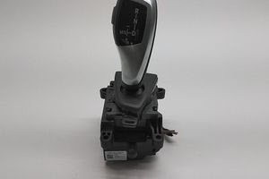

# BMW F-series gear lever (GWS) for sim racing

Connects a real BMW F-series electronic gear selector (GWS) to a PC with an Arduino, so the physical lever shifts gears in driving games. The lever's gear indicator and backlight are driven back from the game's telemetry.

Spinoff of https://github.com/veikkos/e90-can-cluster.

## How it works

- Lever movements are translated into USB-HID gamepad button presses, which the game maps to shift up / down / reverse / mode switch
- The game's current gear is sent back to the board over serial

## Hardware

The lever sits on a 500 kbit/s CAN bus. Because the lever is controlled through a USB-HID gamepad, the board must be able to present one. Currently supported boards are Arduino Micro / Leonardo and Teensy 4.x and alike.

A CAN transceiver (e.g. SN65HVD230) is required on the bus pins for the Teensy. The MCP2515 module includes one.

## Libraries

- [mcp_can](https://github.com/coryjfowler/MCP_CAN_lib) (MCP2515 builds)
- [ArduinoJoystickLibrary](https://github.com/MHeironimus/ArduinoJoystickLibrary) (ATmega32u4 builds).

Teensy uses its built-in USB Joystick. Select a USB Type that includes a joystick under Tools > USB Type.

## Build

1. Pick the CAN adapter in [config.h](config.h)
2. Install the libraries above as needed
3. Install the sketch

## Telemetry from the PC

Shifter uses same binary protocol and proxy as the [cluster project](https://github.com/veikkos/e90-can-cluster/#custom-end-to-end-solution).

### Configuration mode

When no telemetry has arrived from the game for 5 seconds (game closed, or sitting in its bindings menu), the lever automatically acts as a plain button box: lever moves still press the gamepad buttons, but the lever state is never forced to match the stale game state. Use this to bind the lever's gamepad buttons in the game:

- Automatic gearbox Drive: push the selector down from N
- Automatic gearbox Reverse: push the selector up from N
- Park: press the selector's park button
- Gearbox Automatic/Sequential switch: push sideways from D
- Shift up: push the selector down
- Shift down: push the selector up

Gear buttons are held while the gear is engaged; no gear button held means neutral, so neutral needs no binding of its own. The Automatic/Sequential switch is likewise held while the lever sits in the manual gate, released for automatic, and the shift up/down buttons are held for as long as the lever is held in its detent.

Normal synced operation resumes by itself as soon as telemetry flows again.

## Credits

- [TeksuSiK/bmw-gws-simhub](https://github.com/TeksuSiK/bmw-gws-simhub) for the original gear-lever logic.
- [OpenInverter.org — BMW F-Series Gear Lever](https://openinverter.org/wiki/BMW_F-Series_Gear_Lever) for the CAN messages.
