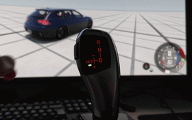

# BMW F-series gear lever (GWS) for sim racing

Connects a real BMW F-series electronic gear selector (GWS) to a PC with an Arduino, so the physical lever shifts gears in driving games. The lever's gear indicator and backlight are driven back from the game's telemetry.

Spinoff of https://github.com/veikkos/e90-can-cluster.

## How it works

- Lever movements are translated into USB-HID gamepad button presses
- The game's current gear is sent back to the lever over serial for synchronization purposes
- The joystick automatically exits from M/S slot when needed

## Hardware

The lever works on a 500 kbit/s CAN bus. The Arduino board needs to have Joystick support. Currently supported boards are Arduino Micro / Leonardo and Teensy 4.x (untested) and alike.

A CAN transceiver (e.g. SN65HVD230) is required on the bus pins for the Teensy. The MCP2515 module includes one.

**Note:** If you have the 10 pin connector variant of the lever, you should use the CAN in pins 3 and 4. While the lever also has another CAN in pins 5 and 6, that does not support the backlight feature. Also worth noting that with pins 3 and 4 there should be 120 Ohm termination but with pins 5 and 6 the termination is not required.

## Libraries

- [mcp_can](https://github.com/coryjfowler/MCP_CAN_lib) (MCP2515 builds)
- [ArduinoJoystickLibrary](https://github.com/MHeironimus/ArduinoJoystickLibrary) (ATmega32u4 builds).

Teensy uses its built-in USB Joystick. Select a USB Type that includes a joystick under Tools > USB Type.

## Build

1. Pick the CAN adapter in [config.h](config.h)
2. Install the libraries above as needed
3. Install the sketch

## Telemetry from the PC

**Note:** SimHub support is not planned.

Shifter uses same binary protocol and proxy as the [cluster project](https://github.com/veikkos/e90-can-cluster/#custom-end-to-end-solution).

It is possible to use the lever without telemetry as well.

### Configuration / standalone mode

When no telemetry has arrived from the game for 5 seconds (proxy is not on or the game is not responding), the lever automatically goes into configuration mode. Use this to bind the lever's gamepad buttons in the game.

### BeamNG.drive

Bind the lever's gamepad buttons in BeamNG's controller settings as follows:

| Shifter         | BeamNG    |
| --------------- | --------- |
| Park            | 1st gear  |
| Drive           | 2nd gear  |
| Sport           | 3rd gear  |
| Manual          | 6th gear  |
| Reverse         | Reverse   |
| Push in M/S     | Gear down |
| Pull in M/S     | Gear up   |

To bind, first engage and then disengage a gear. "Sport" is bound by moving the lever to M/S and back. "Manual" can be bound by having the shifter in M/S and then flicking once up and then disengage M/S. Up/Down shift can be bound if flicking once before actually binding in-game.

## Credits

- [TeksuSiK/bmw-gws-simhub](https://github.com/TeksuSiK/bmw-gws-simhub) for the original gear-lever logic
- [OpenInverter.org — BMW F-Series Gear Lever](https://openinverter.org/wiki/BMW_F-Series_Gear_Lever) for the CAN messages
